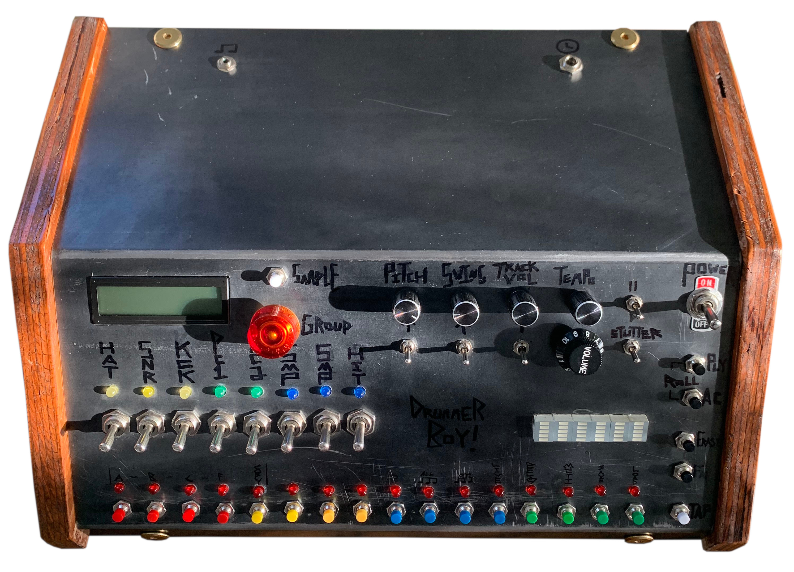

# DrummerBoy
An 8 bit, Arduino based drum machine. Like a real drummer but this one stays in time and doesnt yell at you.

Features
+ 128 wav samples
+ save/load capeability
+ pattern linking
+ 6 layers (hat, snare, kick, percussion 1, percussion 2, samples 1, samples 2, hits)
+ real time pitch modulation
+ individual track volumes
+ swing and accents
+ triplet timing
+ onboard spectrometer

This project makes good use of the wav trigger from Sparkfun, an arduino mega, lots of 74hc595's, an 24LC256 for extra EEPROM memory, and a couple custom pcb's to hold everything together. Its proven to be a ton of fun to jam to.

