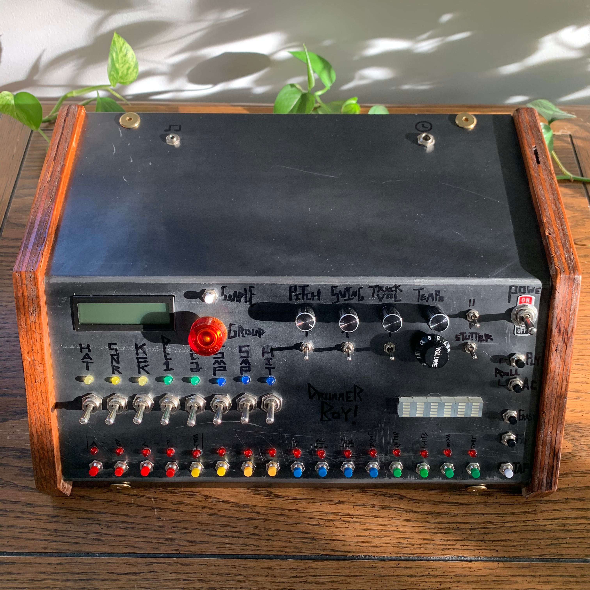

# DrummerBoy
An 8 bit, Arduino based drum machine.

Features
+ 128 wav samples
+ save/load capeability
+ pattern linking
+ 6 layers (hat, snare, kick, percussion 1, percussion 2, samples 1, samples 2, hits)
+ real time pitch modulation
+ individual track volumes
+ swing and accents
+ triplet timing

